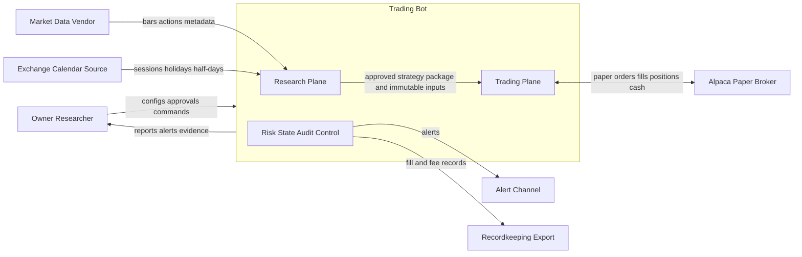
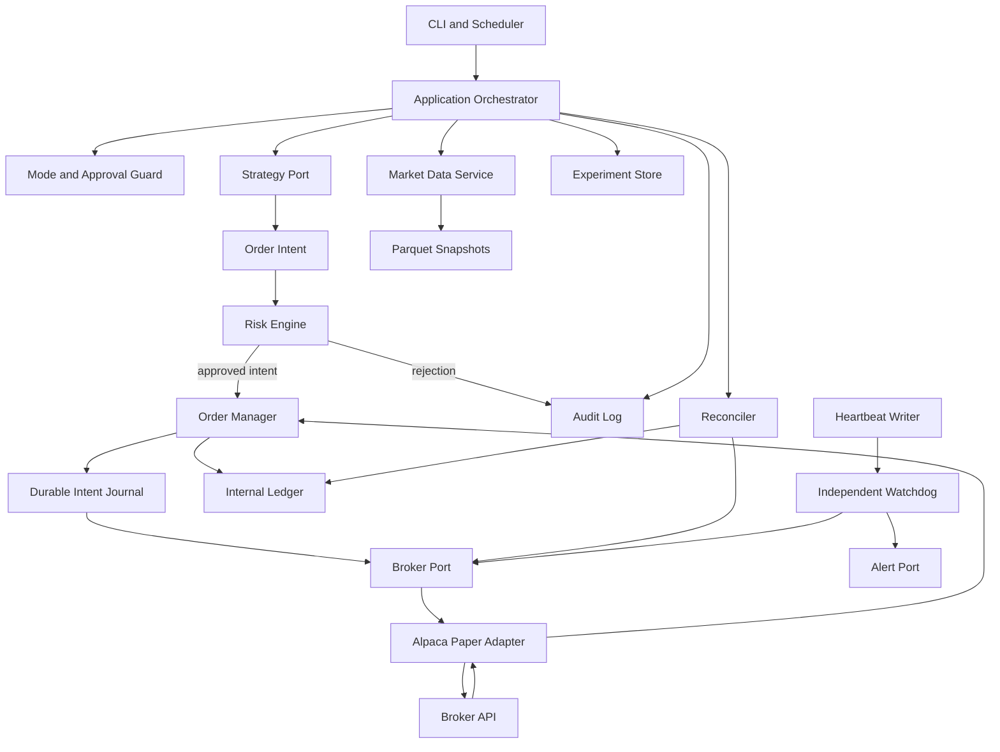
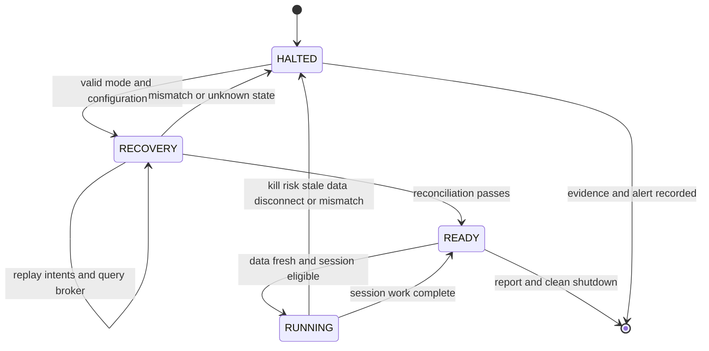
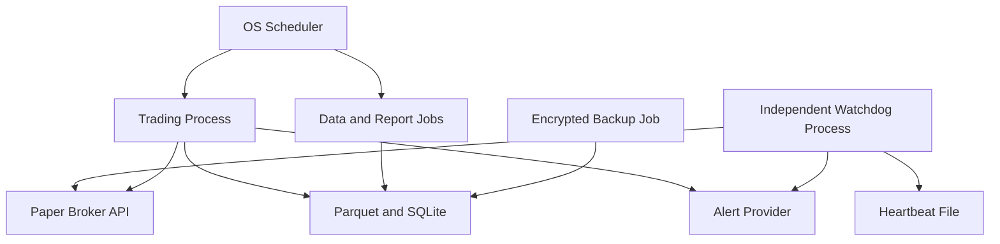

# Trading Bot System Architecture

<details open>
<summary><b>Contents</b></summary>

- [Purpose](#purpose)
- [Architecture Drivers](#architecture-drivers)
- [System Context](#system-context)
- [Component Model](#component-model)
  - [Research Plane](#research-plane)
  - [Trading Plane](#trading-plane)
  - [Shared Control Plane](#shared-control-plane)
- [Runtime Flows](#runtime-flows)
  - [Historical Backtest Flow](#historical-backtest-flow)
  - [Paper Session Flow](#paper-session-flow)
  - [Startup Recovery Flow](#startup-recovery-flow)
- [State Ownership](#state-ownership)
- [Module Boundaries](#module-boundaries)
- [Storage Layout](#storage-layout)
- [Deployment Topology](#deployment-topology)
- [Failure Model](#failure-model)
- [Technology Decisions](#technology-decisions)
- [Architecture Invariants](#architecture-invariants)
- [Deferred Decisions](#deferred-decisions)

</details>

---

**Version:** 1.0  
**Date:** 30 August 2026  
**Status:** Proposed baseline  
**Related:** [Requirements](01-requirements.md) | [Project Charter](../CHARTER.md)

## Purpose

This document defines the system boundaries, ownership rules, dependency direction, runtime flows, and failure behavior for the first trading-bot implementation. It deliberately favors one understandable process over distributed infrastructure.

## Architecture Drivers

1. **Fail closed.** Ambiguous broker, data, time, or state conditions stop new trading.
2. **Risk before execution.** No route exists from a strategy directly to a broker adapter.
3. **Reproducible evidence.** Code, configuration, data, and seeds identify every result.
4. **Restart correctness.** The process assumes it can die at any instruction and recovers from durable intent plus broker truth.
5. **Temporal integrity.** Information availability and order eligibility are explicit domain concepts.
6. **Fast research iteration.** Daily-bar workloads remain local and simple until measurements justify more infrastructure.
7. **Replaceable edges.** Data and broker vendors sit behind narrow ports; domain rules do not depend on vendor objects.

## System Context



The system never treats a vendor, broker, or alert provider as trusted application state. Inputs are validated at the boundary, and broker facts are reconciled against internal intent.

## Component Model



### Research Plane

| Component | Responsibility | Must not do |
|---|---|---|
| Data ingestion | Fetch, normalize, validate, snapshot, and manifest historical data | Rewrite a published snapshot |
| Backtest engine | Advance event time, simulate orders and fills, maintain simulated ledger | Read future data or broker credentials |
| Strategy runner | Evaluate a pre-registered strategy against an approved input view | Submit an external order |
| Experiment tracker | Record every run, input identity, status, metrics, and artefact location | Delete failed or unfavorable trials |
| Promotion evaluator | Apply fixed research gates | Override a failed criterion |

Research output is evidence, not executable permission. A promoted strategy must be packaged with a versioned contract and approved configuration before the trading plane can load it.

### Trading Plane

| Component | Responsibility | Must not do |
|---|---|---|
| Session orchestrator | Run startup, market-data readiness, strategy, risk, order, and shutdown phases | Skip recovery or reconciliation |
| Strategy runtime | Produce deterministic target or order intents from approved data | Call adapters or change risk limits |
| Risk engine | Evaluate every intent against fresh state and all hard limits | Warn and continue after a failed hard check |
| Order manager | Journal intent, submit idempotently, consume updates, and manage state transitions | Blindly resubmit an ambiguous request |
| Broker adapter | Translate domain commands and broker events | Contain strategy or risk policy |
| Internal ledger | Represent expected cash, positions, orders, fills, and PnL | Claim authority over broker facts after restart |
| Reconciler | Compare broker facts with internal intent and ledger state | Conceal or auto-net an unexplained mismatch |

### Shared Control Plane

| Component | Responsibility |
|---|---|
| Mode and approval guard | Enforce `BACKTEST`, `PAPER`, `RECOVERY`, `HALTED`, and future `LIVE` permissions |
| Configuration loader | Parse a typed, schema-versioned configuration and reject incomplete values |
| Clock and calendar | Supply UTC time, exchange sessions, decision cutoffs, and test clocks |
| Audit logger | Emit schema-valid structured events with lineage and stable reason codes |
| Heartbeat and watchdog | Detect process loss independently, cancel approved working orders, and alert |
| Reporting | Produce daily, reconciliation, experiment, and stage-gate evidence |
| Secret provider | Inject credentials at runtime without exposing them to domain code or logs |

## Runtime Flows

### Historical Backtest Flow

1. Load and validate the run configuration and pre-registration record.
2. Resolve an immutable data manifest by content hash.
3. Verify schema, calendar, actions, and all data-validation assertions.
4. Create an isolated simulated clock, broker, ledger, and risk engine.
5. At each event time, expose only data available by that time.
6. Evaluate the strategy and turn its output into an order intent.
7. Apply risk checks, journal the accepted simulated intent, and process it on the next eligible event.
8. Update orders, fills, cash, positions, costs, and equity.
9. Persist all attempted-run metadata even when the run fails.
10. Emit canonical results and reports identified by code, config, data, and seed.

### Paper Session Flow

1. Acquire a single-session lock so only one trading process can own the account strategy.
2. Validate mode, paper endpoint, account identity, approvals, configuration, secret availability, and clock health.
3. Enter `RECOVERY`, fetch broker facts, replay durable intents, and reconcile.
4. Confirm the external kill control is clear and the independent watchdog is healthy.
5. Verify the expected session and current data are complete and fresh.
6. Evaluate the approved strategy once for the decision timestamp.
7. Convert the decision to an intent with a deterministic idempotency key.
8. Evaluate all pre-trade risk checks using a coherent state snapshot.
9. Journal approved intent before broker submission.
10. Submit through the broker port and resolve all accepted, rejected, partial, timeout, and disconnect paths.
11. Reconcile after material order events and at session close.
12. Emit a daily report even when no order was placed, then release the session lock.

### Startup Recovery Flow



Startup never begins in `RUNNING`. Uncertain submit outcomes remain unresolved journal entries until the broker is queried by client order ID and surrounding account activity.

## State Ownership

| State | Authoritative owner | Local representation | Recovery rule |
|---|---|---|---|
| Historical bars and actions | Immutable snapshot plus manifest | Parquet and manifest | Verify hash; never refresh in place |
| Exchange sessions | Versioned calendar input | Cached session table | Rebuild from pinned calendar version |
| Strategy definition | Versioned source and configuration | Strategy package | Match approved code and config hash |
| Order intent | Trading system | Append-only intent journal | Replay before querying outcome |
| Submitted order and fill | Broker | Order and fill ledger | Broker fact wins; unexplained difference halts |
| Cash and positions | Broker during connected operation | Internal ledger | Reconcile with explicit tolerances |
| Risk counters | Derived from broker facts and event journal | Risk state snapshot | Recompute on startup where possible |
| Experiment identity and result | Experiment store plus immutable artefacts | SQLite row and files | Verify linked hashes |
| Approval | Owner-signed decision record | Approval registry | Missing or stale approval denies mode |

There must be exactly one writer for each mutable local store. A process lock prevents concurrent paper runners from using the same account and strategy namespace.

## Module Boundaries

The planned package boundaries are contracts, not a commitment to one class per box:

| Package | Owns | May depend on |
|---|---|---|
| `domain` | Values, events, order states, fills, positions, risk results, reason codes | Standard library only |
| `data` | Provider ports, schemas, calendars, validation, snapshots | `domain`, analytical libraries |
| `strategy` | Strategy port and approved implementations | `domain` and read-only market views |
| `risk` | Limits, coherent risk snapshot, pre-trade checks, halt policy | `domain` |
| `execution` | Order manager, intent journal, broker port, reconciliation | `domain`, `risk` |
| `adapters` | Alpaca, storage, alerts, secrets, clocks | Corresponding application ports |
| `backtest` | Simulated clock, broker, fills, ledger, metrics | Domain and application ports |
| `research` | Pre-registration, experiments, walk-forward, promotion | `backtest`, read-only data |
| `operations` | Orchestration, heartbeat, reports, startup and shutdown | Application services and ports |
| `cli` | Commands and configuration entry points | `operations`, `research` |

The dependency direction points inward toward domain contracts. In particular, `strategy` cannot import `adapters`, and `risk` cannot depend on a broker SDK.

## Storage Layout

```text
data/
  manifests/              immutable dataset manifests
  raw/                    provider payload snapshots
  curated/                validated Parquet datasets by content hash
state/
  trading.sqlite          intents, orders, fills, ledger checkpoints
  experiments.sqlite      registrations, attempted runs, metrics, artefacts
reports/
  backtests/              immutable run reports
  reconciliation/         startup and daily reconciliation evidence
  paper/                  daily and monthly paper reports
logs/
  audit/                  append-only structured event logs
run/
  heartbeat               ephemeral heartbeat
  KILL                    operator kill control when present
```

Runtime data, databases, logs, reports containing account details, and secrets are not source-controlled. Schemas, synthetic fixtures, and redacted examples are source-controlled.

## Deployment Topology

Stage 1 through Stage 4 use one scheduled trading process and one independent watchdog on a single owner-controlled host. Research jobs may run separately but cannot share the mutable paper state database while a trading session is active.



The watchdog must not share the trading process. Its default automated action is to alert and cancel approved working orders. Automatic position flattening is disabled unless a separate, tested policy explicitly enables it; blind flattening during a broker or data incident can increase risk.

## Failure Model

| Failure | Required behavior |
|---|---|
| Data missing, stale, revised, or schema-invalid | Do not evaluate or trade; record and alert |
| Clock unsynchronized or session ambiguous | Halt before decision evaluation |
| Configuration missing or unknown version | Fail startup into `HALTED` |
| Risk input unavailable | Reject intent and halt when continued correctness is uncertain |
| Risk limit reached | Reject order; enter the configured halt state; alert |
| Timeout after broker submit | Mark outcome unknown; query by client ID; never blind retry |
| Broker disconnect | Stop new submissions; preserve intent; reconcile after reconnect |
| Partial fill | Update filled and remaining quantities; recalculate exposure before further action |
| Reconciliation mismatch | Halt and preserve both views for investigation |
| Process crash | Watchdog detects heartbeat loss; approved cancel and alert actions run; startup enters `RECOVERY` |
| Database write failure | Do not submit an order whose intent was not durably journaled |
| Alert failure | Continue in `HALTED`; use secondary channel where configured |
| Backup failure | Alert and block live promotion; paper may continue only by documented decision |

## Technology Decisions

| Area | Baseline | Decision rule |
|---|---|---|
| Language | Python 3.12 or newer | Reconsider only after profiling a binding path |
| Data frames | Polars, with PyArrow interoperability | Pandas is acceptable only where a dependency requires it |
| Analytical storage | Parquet and DuckDB | Reconsider after measured scale or query latency exceeds documented thresholds |
| Transactional local state | SQLite in WAL mode with one writer | Reconsider only when measured concurrency requires it |
| Configuration | YAML parsed into versioned Pydantic models | Unknown keys and versions fail validation |
| Broker | Alpaca paper behind a broker port | Confirm UK eligibility and API terms before implementation acceptance |
| Testing | Pytest plus Hypothesis for invariants | Broker contract tests run against fakes and paper sandbox |
| Scheduling | Windows Task Scheduler for the current host | Move only when deployment target changes |
| Logging | JSON Lines with schemas and redaction | Human console output is secondary, never the audit source |

## Architecture Invariants

- Strategy output is an intent, never a broker command.
- Every external order passes the same risk engine immediately before submission.
- Accepted intent is durable before external side effects begin.
- A request timeout never proves that an order failed.
- Broker state is reconciled before strategy evaluation after every startup.
- All decision inputs share one coherent as-of timestamp.
- Research, paper, and future live evidence remain distinctly labeled and stored.
- Published data snapshots and result artefacts are immutable.
- Secrets and vendor SDK objects never enter domain events or logs.
- The default response to ambiguity is no new risk.

## Deferred Decisions

| Decision | Trigger |
|---|---|
| Exact market-data vendor and corporate-action source | Before reference dataset implementation |
| ETF reference symbol | Stage 0 owner approval |
| Watchdog hosting and secondary alert provider | Before unattended paper operation |
| SQLite backup encryption and retention destination | Before persistent paper-state acceptance |
| Market-on-open versus controlled limit-order execution | Before strategy-specific paper promotion |
| Automatic flatten policy | Only after scenario analysis and explicit owner approval |
| Second broker | First broker path stable and a measured requirement exists |
| Live deployment topology | All paper gates pass and Stage 5 planning begins |
