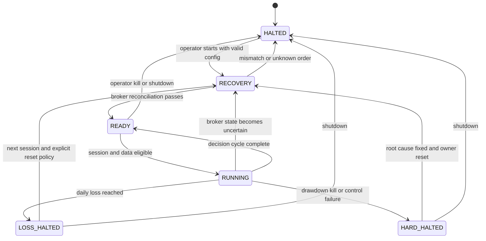

# Risk and Safety Specification

<b>Contents</b>

- [Purpose](#purpose)
- [Safety Policy](#safety-policy)
- [Risk Inputs](#risk-inputs)
- [Required Limits](#required-limits)
- [Pretrade Evaluation](#pretrade-evaluation)
- [Trading State Machine](#trading-state-machine)
- [Kill Controls](#kill-controls)
  - [Internal Halt](#internal-halt)
  - [Operator Kill Control](#operator-kill-control)
  - [Independent Dead Man Control](#independent-dead-man-control)
- [Loss and Drawdown Semantics](#loss-and-drawdown-semantics)
- [Reconciliation Policy](#reconciliation-policy)
- [Restart Policy](#restart-policy)
- [Failure Scenarios](#failure-scenarios)
- [Risk Configuration Governance](#risk-configuration-governance)
- [Verification Matrix](#verification-matrix)

---

**Version:** 1.0  
**Date:** 30 August 2026  
**Status:** Proposed baseline  
**Related:** [Requirements](01-requirements.md) | [Architecture](02-architecture.md) | [Project Charter](../CHARTER.md)

## Purpose

This specification defines mandatory risk controls and failure behavior for backtest, paper, and future live operation. It covers software and operational loss prevention; it does not claim to make a strategy economically sound.

## Safety Policy

1. Protect capital and state integrity before pursuing return.
2. Add no new exposure when required facts are missing, stale, inconsistent, or ambiguous.
3. Evaluate every order, including exits, replacements, recovery actions, and retries, under an explicit action policy.
4. Keep strategy code unable to bypass risk checks or contact a broker.
5. Treat broker acknowledgement, not a local timeout, as evidence of order outcome.
6. Halt on reconciliation breaks and preserve evidence instead of silently repairing state.
7. Separate the ability to cancel risk from the ability to add risk.
8. Require new approval for live values; paper configuration is never an implicit live default.

An exit order can reduce one risk while increasing another through oversell, stale quantity, or duplicate submission. Therefore exits are not globally exempt from validation. In a halt state, only narrowly defined **risk-reducing actions** may be allowed.

## Risk Inputs

All pre-trade checks must consume one immutable risk snapshot with a single `as_of_utc` value.

| Input | Source | Freshness rule | Missing or stale behavior |
|---|---|---|---|
| Proposed order intent | Order manager | Current decision cycle | Reject |
| Last tradable price and quote context | Approved market-data view | Strategy and venue-specific threshold | Reject and halt session |
| Broker positions | Most recent reconciled broker snapshot | Must be reconciled this startup and after material events | Reject and enter `RECOVERY` |
| Open and pending orders | Order manager plus broker snapshot | Current through last acknowledged event | Resolve ambiguity before proceeding |
| Cash and account equity | Broker | Current session threshold | Reject |
| Session-start equity | Durable session checkpoint | Fixed at approved session start | Halt if unavailable |
| High-water equity | Durable risk state | Updated only by documented mark policy | Halt if unavailable |
| Average daily volume | Validated historical snapshot | Configured lookback and maximum age | Reject symbol |
| Exchange session | Versioned exchange calendar and UTC clock | Current | Reject outside allowed window |
| Order-rate counters | Durable event journal | Rolling configured interval | Reject if unavailable or exceeded |
| Kill state and heartbeat state | Control plane | Checked immediately before submission | Reject and halt |

Risk calculations use conservative prices: the worse of the intent limit, current executable side, or a configured stress price where applicable. Pending buy orders count toward long exposure; pending sell orders count toward short or oversell exposure.

## Required Limits

Every field is required in a versioned risk profile. There are no code defaults for capital-dependent limits.

| Limit key | Definition | Reject or halt behavior |
|---|---|---|
| `allowed_symbols` | Exact symbol allowlist | Reject and alert on any other symbol |
| `allowed_order_types` | Permitted order types and time-in-force values | Reject |
| `allowed_session_window` | Earliest and latest submission time by exchange session | Reject |
| `max_order_notional` | Maximum conservative notional for one logical order | Reject |
| `max_order_quantity` | Maximum units for one logical order | Reject |
| `max_position_notional_per_symbol` | Maximum projected absolute position notional | Reject |
| `max_position_pct_equity` | Maximum projected symbol concentration | Reject |
| `max_gross_exposure` | Maximum sum of projected absolute notionals | Reject |
| `max_net_exposure` | Maximum absolute projected signed notional | Reject |
| `max_leverage` | Maximum projected gross exposure divided by equity | Reject; Stage 1 value may not exceed 1.0 |
| `max_open_positions` | Maximum nonzero projected symbol positions | Reject |
| `max_orders_per_minute` | Maximum logical submissions in a rolling 60-second window | Reject and halt for manual review |
| `max_daily_loss` | Maximum session loss under the documented equity mark | Halt new risk for the session |
| `max_drawdown_from_peak` | Maximum loss from durable high-water equity | Persistent halt requiring approval |
| `max_position_pct_adv` | Maximum projected position quantity as percent of median daily volume | Reject; promotion ceiling is 1% |
| `max_data_age` | Maximum age of each required data type | Reject and halt session |
| `max_clock_offset` | Maximum tolerated host UTC clock error | Halt startup or session |

Stage 1 is long-only and unleveraged. The profile must therefore also set `allow_short = false`, `allow_margin = false`, and `max_leverage <= 1.0`. Numeric paper values are approved after the owner selects the paper reference equity. Live values remain absent until Stage 5 approval.

## Pretrade Evaluation

Checks run in this order so cheap global stops occur before calculations or side effects:

1. Validate operating mode and approval registry.
2. Check internal halt, operator kill, watchdog health, and account lock.
3. Validate the intent schema, client order ID, strategy approval, symbol, side, order type, and time in force.
4. Validate UTC clock, exchange session, allowed order window, and data freshness.
5. Confirm startup and current reconciliation status.
6. Resolve or reject any ambiguous in-flight order for the same strategy and symbol.
7. Build one coherent projected-state snapshot including open and pending orders.
8. Apply quantity, notional, concentration, exposure, leverage, position-count, ADV, and rate limits.
9. Apply daily loss and drawdown controls.
10. Classify the action as adding, neutral, or reducing risk.
11. Emit an immutable risk decision with all input identities and stable reason codes.
12. Journal an approved intent durably.
13. Recheck volatile global controls immediately before the adapter call.

A rejection must identify the failed rule without logging secrets or unnecessary account data. Passing one check never suppresses later checks unless a global fail has already denied the order.

Suggested stable reason-code families are `MODE_*`, `KILL_*`, `TIME_*`, `DATA_*`, `STATE_*`, `ORDER_*`, `EXPOSURE_*`, `LOSS_*`, and `CONTROL_*`.

## Trading State Machine

| State | New exposure | Risk-reducing order | Cancel working order | Strategy evaluation |
|---|---|---|---|---|
| `RECOVERY` | Denied | Only through approved recovery procedure | Allowed where identity is known | Denied |
| `READY` | Denied | Not applicable | Allowed | Denied |
| `RUNNING` | Subject to all checks | Subject to all checks | Allowed | Allowed |
| `LOSS_HALTED` | Denied | Allowed only by pre-approved policy | Allowed | Denied |
| `HARD_HALTED` | Denied | Manual or pre-approved emergency policy only | Allowed where broker identity is confirmed | Denied |
| `HALTED` | Denied | Denied except explicit recovery command | Allowed where broker identity is confirmed | Denied |

Reset is an auditable action. Restarting the process must not clear a daily-loss, drawdown, kill, or unresolved-reconciliation state.

## Kill Controls

### Internal Halt

The application can set a durable halt for a risk breach, state ambiguity, stale data, broker failure, or operator command. The halt is checked at each decision boundary and again immediately before submission. It blocks new strategy risk and emits an alert and audit event.

### Operator Kill Control

An out-of-process control, initially a `run/KILL` file, must move the system to `HARD_HALTED` within one control cycle. Its content should include an optional operator reason; its mere presence is sufficient. The process must never delete the control automatically. Only an explicit owner reset after review can clear it.

The operator kill must remain usable without changing code, editing configuration, or redeploying.

### Independent Dead Man Control

The trading process writes an atomic heartbeat containing session identity, UTC timestamp, mode, and state. An independent watchdog validates both age and expected session schedule.

On heartbeat expiry, the default watchdog policy is:

1. Emit alerts through primary and configured secondary channels.
2. Query the verified paper account.
3. Cancel known working orders using idempotent cancel requests.
4. Record the broker response and leave positions unchanged.
5. Keep the trading process blocked in `RECOVERY` on restart.

Automatic flattening is disabled by default because stale prices, venue outages, duplicate recovery, or wide markets can make it add loss. A future flatten policy requires explicit per-instrument approval, price protection, idempotency, scenario tests, and broker-side behavior review.

## Loss and Drawdown Semantics

Ambiguous loss definitions make limits unreliable. The implementation must use these documented concepts:

- **Session-start equity:** reconciled broker net liquidation value captured at the configured session boundary.
- **Current risk equity:** broker net liquidation value using the approved mark policy, reduced by conservative estimates for unresolved fees and open-order exposure.
- **Daily PnL:** current risk equity minus session-start equity, adjusted only for documented external cash flows.
- **High-water equity:** greatest approved end-of-session reconciled equity observed since the last capital-allocation reset.
- **Drawdown:** current risk equity divided by high-water equity minus one.

Daily loss includes realized and unrealized PnL and estimated costs. Deposits and withdrawals do not count as trading PnL and require a capital-flow record. A crossed daily-loss limit is sticky through the session. A drawdown halt is sticky across restart and session boundaries until owner review.

## Reconciliation Policy

Reconciliation runs at startup, after reconnect, after an ambiguous submission, after material order updates, and at session close.

| Domain | Comparison | Tolerance | Mismatch action |
|---|---|---|---|
| Account identity and mode | Exact approved account and paper status | None | `HARD_HALTED` |
| Positions | Symbol, signed quantity, average cost metadata | Quantity exact for whole units; documented decimal tolerance if fractional | `RECOVERY`, alert |
| Cash and equity | Currency-specific amounts | Explicit rounding and unsettled-cash tolerance | `RECOVERY`, alert |
| Open orders | Client ID, broker ID, symbol, side, total, filled, remaining, status | None except documented broker normalization | `RECOVERY`, alert |
| Fills | Broker fill ID, order IDs, quantity, price, fees, timestamp | No missing or duplicate fill IDs | `RECOVERY`, alert |

The reconciliation report stores both views and the applied tolerances. It may propose a resolution but must not silently alter records to make the comparison pass.

## Restart Policy

1. Start in `HALTED`, acquire the process lock, and validate configuration and account identity.
2. Enter `RECOVERY`; do not load strategy execution permission.
3. Replay durable intents and events from the last consistent checkpoint.
4. Fetch broker account, positions, open orders, recent orders, and fills with pagination and a time overlap.
5. Resolve intent states by deterministic client order ID.
6. Rebuild risk counters, session equity, high-water equity, and strategy state from durable facts.
7. Reconcile every domain and persist the report.
8. Adopt or cancel surviving orders according to the approved order policy.
9. Enter `READY` only when all blocking checks pass and no unresolved outcome remains.
10. Require fresh session data before entering `RUNNING`.

The crash test matrix must inject termination before intent journaling, after journaling but before submit, during submit, after broker acceptance but before local acknowledgement, during a partial fill, during cancel, and during ledger update.

## Failure Scenarios

| Scenario | Expected safe outcome |
|---|---|
| Strategy loop emits repeated identical intents | Deterministic ID and order-rate limit prevent duplicates; session halts |
| Quote or bar stops updating | Freshness check blocks evaluation and alerts |
| Host clock shifts beyond threshold | Session halts before time-sensitive decisions |
| Network fails before broker receives request | Journal remains pending; query confirms absence before any controlled retry |
| Network fails after broker receives request | Query by client ID adopts original order; no resubmit |
| Order partially fills then disconnects | Filled exposure counts immediately; recovery queries remaining order and fills |
| Cancel and fill cross | Final broker facts reconcile both events; no replacement until resolved |
| Broker rejects order | Rejection is durable; strategy cannot immediately loop-retry without policy |
| Broker reports unknown symbol position | New trading halts; position is not auto-liquidated |
| Process dies with a working order | Watchdog alerts and cancels the identified order; restart reconciles |
| Process dies with an open position | Watchdog alerts; position remains; restart reconciles and follows approved recovery policy |
| Daily loss threshold is crossed during restart | Recomputed state enters `LOSS_HALTED`; restart does not reset it |
| Risk database cannot commit | No external submission occurs without durable intent and risk decision |
| Kill control exists before startup | Process remains `HARD_HALTED` and reports the reason |

## Risk Configuration Governance

- Risk profiles are immutable, schema-versioned files identified by hash.
- The selected profile, operating mode, account, and strategy approval must agree.
- Unknown keys, missing values, non-finite numbers, contradictory values, and unsafe unit conversions fail validation.
- Absolute currency limits state their currency; percentage limits state their denominator and mark time.
- Tightening a value can take effect after validation and audit recording.
- Relaxing a value requires rationale, owner approval, affected-test review, and a new profile version.
- Live profiles cannot inherit or interpolate paper values.
- Capital changes require a new session boundary and risk-profile review; limits do not scale automatically.
- The system displays effective limits and their hash in startup and daily reports.

## Verification Matrix

| Control | Minimum verification |
|---|---|
| Each hard limit | Boundary below, equal, above, missing-input, and property-based invariant tests |
| Projection logic | Pending buys, pending sells, partial fills, gaps, fees, and adverse-price fixtures |
| Order rate | Rolling-window boundary, restart persistence, and burst test |
| Daily loss | Realized, unrealized, fees, deposit, withdrawal, restart, and session-boundary tests |
| Drawdown | New high, decline, capital flow, restart, and sticky-reset tests |
| Operator kill | Present before startup and created during each order lifecycle phase |
| Watchdog | Stale heartbeat, malformed heartbeat, duplicate watchdog run, API outage, cancel race |
| Reconciliation | One mismatch fixture for account, position, cash, order, and fill domains |
| Restart | Crash injection at every durable-state and external-side-effect boundary |
| Live denial | Missing approval, paper credential, wrong endpoint, absent limit, and stale sign-off tests |

No paper stage gate passes on unit tests alone. The same controls must be exercised through the paper broker path and through induced process and network failures.