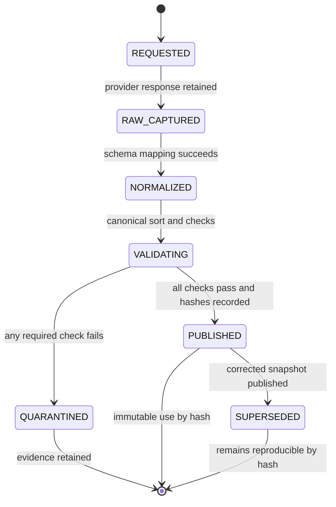

# Market Data Specification

<b>Contents</b>

- [Purpose](#purpose)
- [Data Scope](#data-scope)
- [Source Qualification](#source-qualification)
- [Canonical Schemas](#canonical-schemas)
  - [Dataset Manifest](#dataset-manifest)
  - [Daily Bar](#daily-bar)
  - [Corporate Action](#corporate-action)
  - [Universe Membership](#universe-membership)
- [Time and Availability Semantics](#time-and-availability-semantics)
- [Dataset Lifecycle](#dataset-lifecycle)
- [Twelve Mandatory Validation Rules](#twelve-mandatory-validation-rules)
- [Corporate Action Policy](#corporate-action-policy)
- [Universe and Survivorship Policy](#universe-and-survivorship-policy)
- [Snapshot and Revision Policy](#snapshot-and-revision-policy)
- [Current Data Freshness](#current-data-freshness)
- [Data Quality States](#data-quality-states)
- [Acceptance Evidence](#acceptance-evidence)
- [Open Decisions](#open-decisions)

---

**Version:** 1.0  
**Date:** 30 August 2026  
**Status:** Proposed baseline  
**Related:** [Requirements](01-requirements.md) | [Architecture](02-architecture.md)

## Purpose

This specification defines the lineage, schema, temporal meaning, validation, immutability, and revision handling of market data used by research and paper trading. A backtest is only reproducible when the exact information available at each decision time can be reconstructed.

## Data Scope

Stage 1 requires:

- Raw and adjusted daily OHLCV bars for one approved liquid US-listed ETF.
- Exchange session dates, regular-session open and close timestamps, holidays, and half-days.
- Splits, cash dividends, symbol changes, and other provider-supported corporate actions.
- Provider metadata sufficient to identify the request and response.
- An immutable manifest and content hash for each published dataset.

Stage 2 may widen to a small fixed ETF allowlist. Broad equity-universe research is prohibited until point-in-time membership, delistings, and corporate actions are available or the resulting bias is explicitly scoped as exploratory and barred from promotion.

Fundamentals, news, level-two quotes, ticks, options, and intraday bars are not part of the initial data contract.

## Source Qualification

A source is approved for a use only after the following are documented:

| Qualification | Required evidence |
|---|---|
| Legal use | Terms permit automated retrieval, local storage, research, and intended paper or live use |
| Instrument identity | Stable mapping among provider symbol, exchange listing, currency, and internal instrument ID |
| Timestamp definition | Provider states whether timestamps represent session, open, close, publication, or retrieval |
| Adjustment method | Split and dividend adjustment behavior is documented and testable |
| Revision behavior | Historical corrections and restatements are possible and detectable |
| Coverage | Requested history, delistings where applicable, actions, holidays, and half-days are characterized |
| Reliability | Rate limits, outage behavior, completeness, and support path are known |
| Cost | Subscription and redistribution restrictions are recorded |

Free data may be used for the single-ETF vertical slice if its limitations are recorded. It must not support a claim requiring survivorship-free or as-reported history that it does not provide.

## Canonical Schemas

All schemas are versioned. Unknown fields may be retained in raw payloads but do not silently enter a canonical table. Required analytical numeric fields reject NaN and infinity.

### Dataset Manifest

| Field | Type | Rule |
|---|---|---|
| `manifest_version` | string | Semantic schema version |
| `dataset_id` | string | Stable ID derived from dataset type and content hash |
| `dataset_type` | enum | `daily_bars`, `corporate_actions`, `calendar`, or `universe` |
| `provider` | string | Approved provider identifier |
| `provider_dataset` | string | Provider product or endpoint identity |
| `request_parameters` | object | Canonical sorted request excluding secrets |
| `retrieved_at_utc` | UTC timestamp | Actual completed retrieval time |
| `effective_start` | date | Earliest covered session or effective date |
| `effective_end` | date | Latest covered session or effective date |
| `instrument_ids` | array | Sorted internal IDs included |
| `row_count` | integer | Canonical table row count |
| `schema_name` | string | Canonical schema identity |
| `schema_version` | string | Canonical schema version |
| `calendar_name` | string | Exchange calendar identity and version |
| `adjustment_policy` | string | Versioned policy identifier |
| `source_hash` | string | Hash of retained raw source content |
| `content_hash` | string | SHA-256 of canonical serialized content |
| `parent_dataset_ids` | array | Inputs used to derive this dataset |
| `validation_result` | enum | Must be `PASSED` before publication |
| `validation_report` | path | Content-addressed validation artefact |
| `license_reference` | string | Local reference to approved source terms review |

Hashes are calculated from canonical bytes, not filesystem metadata or unordered JSON.

### Daily Bar

| Field | Type | Rule |
|---|---|---|
| `instrument_id` | string | Stable internal ID; provider symbols are aliases |
| `symbol` | string | Symbol valid for that session |
| `exchange` | string | Primary listing or trading venue used for calendar rules |
| `currency` | string | ISO 4217 code |
| `session_date` | date | Exchange-local trading date |
| `bar_open_utc` | UTC timestamp | Regular-session open |
| `bar_close_utc` | UTC timestamp | Regular-session close |
| `available_at_utc` | UTC timestamp | Earliest time this complete bar is safe for strategy use |
| `open` | float64 | Raw trade price, positive and finite |
| `high` | float64 | Raw trade price, positive and finite |
| `low` | float64 | Raw trade price, positive and finite |
| `close` | float64 | Raw trade price, positive and finite |
| `volume` | int64 | Nonnegative provider-defined share volume |
| `adjusted_open` | float64 | Adjusted under the manifest policy |
| `adjusted_high` | float64 | Adjusted under the manifest policy |
| `adjusted_low` | float64 | Adjusted under the manifest policy |
| `adjusted_close` | float64 | Adjusted under the manifest policy |
| `adjusted_volume` | float64 | Adjustment-aware volume where supplied or derived |
| `provider_symbol` | string | Source symbol for traceability |
| `source_row_id` | string or null | Provider row identity when available |

Analytical prices may use binary floating point, but broker cash, fees, order prices, and tax exports use decimal arithmetic with explicit currency precision. Execution simulation uses raw prices. A strategy may use adjusted prices only when its declaration states the series and the adjustment policy.

### Corporate Action

| Field | Type | Rule |
|---|---|---|
| `action_id` | string | Stable source or derived identity |
| `instrument_id` | string | Stable across symbol changes where possible |
| `action_type` | enum | `split`, `cash_dividend`, `symbol_change`, `merger`, `spinoff`, `delisting`, or documented extension |
| `ex_date` | date | Exchange-local ex-date |
| `record_date` | date or null | Retained when available |
| `pay_date` | date or null | Retained when available |
| `available_at_utc` | UTC timestamp | When the action information became usable for the applicable purpose |
| `ratio` | decimal or null | Split or exchange ratio |
| `cash_amount` | decimal or null | Per-unit amount |
| `currency` | string or null | ISO 4217 code for cash amount |
| `old_symbol` | string or null | Prior provider symbol |
| `new_symbol` | string or null | New provider symbol |
| `source_payload_ref` | string | Retained raw evidence reference |

Announcement time and effective date are different facts. A backtest must not use an action announcement before `available_at_utc`, while mechanical price and position adjustments apply according to effective-date rules.

### Universe Membership

| Field | Type | Rule |
|---|---|---|
| `universe_id` | string | Versioned universe definition |
| `instrument_id` | string | Stable instrument identity |
| `effective_from` | UTC timestamp | Inclusive membership start |
| `effective_to` | UTC timestamp or null | Exclusive membership end |
| `known_at_utc` | UTC timestamp | When this membership fact was available |
| `inclusion_reason` | string | Index, liquidity screen, fixed allowlist, or other declared rule |
| `source_row_id` | string or null | Provider evidence |

A current constituent list copied backward is never a point-in-time universe.

## Time and Availability Semantics

- UTC is the internal timestamp standard. Session dates remain exchange-local dates.
- All timestamp fields are timezone-aware. Naive timestamps fail ingestion.
- The exchange calendar defines sessions, holidays, early closes, and daylight-saving transitions.
- `bar_close_utc` describes the market interval. `available_at_utc` describes information availability and can be later.
- A strategy view at decision time $t$ includes only records where `available_at_utc <= t`.
- A complete daily signal computed from session $t$ can first generate an order eligible for session $t+1$ under the strategy execution policy.
- Retrieval time is not substituted for historical availability time. When the provider cannot supply publication history, the limitation is recorded and a conservative availability rule is used.
- Calendar updates are versioned. Re-running history uses the pinned calendar version from the dataset manifest.

One reference session around each US and UK daylight-saving transition and one known half-day must be included in acceptance fixtures.

## Dataset Lifecycle

Only `PUBLISHED` datasets may be used for promotion evidence or paper decisions. A `SUPERSEDED` dataset remains accessible for replay but is not selected for new runs unless explicitly pinned for investigation.

## Twelve Mandatory Validation Rules

| ID | Validation | Failure evidence |
|---|---|---|
| DV-001 | No duplicate `(instrument_id, session_date)` rows | Duplicate keys and source references |
| DV-002 | No missing expected sessions between effective bounds according to the pinned exchange calendar | Missing session list, excluding documented suspension cases |
| DV-003 | All timestamps are timezone-aware UTC and session dates map to the expected exchange session | Offending fields and expected offsets |
| DV-004 | For raw and adjusted bars, `low <= open <= high`, `low <= close <= high`, and `low <= high` | Offending rows |
| DV-005 | Prices are positive and finite; volume is nonnegative and within representable bounds | Invalid values and rows |
| DV-006 | Any absolute single-session return above the configured plausibility bound has a matching reviewed action or quarantine exception | Return, threshold, nearby actions, and review state |
| DV-007 | Raw and adjusted series are both present and reconcile to the declared split and dividend policy within tolerance | Factor discontinuities and expected factors |
| DV-008 | Volume is not identically zero and suspicious zero runs for a liquid instrument are reviewed | Zero-run intervals |
| DV-009 | Required fields contain no nulls after an explicitly declared warm-up period; ingestion never silently forward-fills | Null coordinates and policy |
| DV-010 | Actual session and row counts match expected counts within only documented suspension or listing bounds | Expected, actual, and exceptions |
| DV-011 | Canonical content hash, raw hash, row count, schema version, and validation report are recorded and verify on reload | Manifest mismatch details |
| DV-012 | A repeated pull is compared with prior overlapping snapshots; any changed historical value creates a revision event and new immutable dataset | Cell-level diff summary and both dataset IDs |

All checks fail loudly with a stable validation code. Warning-only exceptions require a documented policy, an owner-visible report, and must not weaken the twelve required outcomes.

## Corporate Action Policy

- Retain both raw and adjusted price series.
- Use raw prices for simulated execution and broker reconciliation.
- Apply splits to position quantity and cost basis at the effective boundary without creating economic PnL.
- Apply cash dividends to cash and total-return accounting under a declared ex-date and pay-date policy.
- Never infer an unexplained extreme move to be a split without action evidence.
- Preserve stable instrument identity through symbol changes; symbols are dated aliases.
- A merger, spinoff, or delisting unsupported by the engine makes the affected broad-universe run ineligible for promotion.
- Vendor adjustment factors are checked against retained actions where coverage permits.

For the initial single-ETF system, unsupported complex actions quarantine the affected interval instead of being approximated silently.

## Universe and Survivorship Policy

The Stage 1 universe is a fixed allowlist approved before the test period and used to validate machinery, not to support a broad cross-sectional edge claim.

For later cross-sectional research:

1. Membership must be effective-dated and known-at-dated.
2. Delisted and failed instruments must remain present through their final tradable event.
3. Liquidity and price screens must be calculated from information available at the screen date.
4. Symbol changes must not create a new economic instrument accidentally.
5. Missing delisting returns or corporate-action outcomes must be disclosed and sensitivity-tested.
6. If point-in-time membership is unavailable, results are exploratory and cannot pass the strategy promotion gate.

## Snapshot and Revision Policy

- Raw responses are captured before normalization when provider terms permit.
- Canonical rows use a deterministic column order, row sort, null representation, and serialization profile before SHA-256 hashing.
- Published paths are content-addressed. No command overwrites a published object.
- A convenience alias such as `latest` may point to a manifest but is resolved to a hash before a run begins.
- Every run stores the resolved dataset IDs, not the alias.
- Overlapping pulls generate field-level revision summaries by instrument and session.
- Material revisions invalidate affected cached results and open a review; they do not erase old results.
- The definition of materiality is versioned and errs toward review for prices, actions, and membership.

## Current Data Freshness

A paper session must validate:

- The expected prior session exists and is marked complete by the provider-specific availability rule.
- No expected session gap exists through the decision boundary.
- The dataset manifest was built within the configured operational age.
- The system clock offset is acceptable.
- The symbol, exchange, and currency match the approved instrument registry.
- Corporate actions effective before the next order window have been ingested or explicitly ruled absent.
- A provider outage or unchanged stale response cannot be mistaken for a quiet market.

Freshness thresholds are configuration values with units and source-specific rationale. A timestamp that merely reflects local cache access is not evidence of fresh market data.

## Data Quality States

| State | Meaning | Permitted use |
|---|---|---|
| `RAW` | Retained provider content not yet normalized | Investigation only |
| `QUARANTINED` | At least one required validation failed | No backtest promotion or trading |
| `EXPLORATORY` | Technically valid but known bias or coverage limitation blocks formal evidence | Development and explicitly labeled exploratory research |
| `PUBLISHED` | All required checks pass for declared scope | Backtest and paper use |
| `SUPERSEDED` | A later corrected snapshot exists | Replay and revision analysis only by explicit hash |
| `REVOKED` | Legal, corruption, or severe integrity issue prohibits use | No use; retain metadata needed for audit |

## Acceptance Evidence

- A ten-year reference dataset builds into Parquet with manifest and hashes.
- Reloaded canonical bytes reproduce the same content hash.
- One synthetic negative fixture for each `DV-*` rule is quarantined with the expected code.
- US holiday, half-day, leap-year, and both daylight-saving transition fixtures pass.
- A split and cash-dividend fixture reconcile raw and adjusted series and portfolio accounting.
- Re-pulling an unchanged fixture produces the same content hash.
- Re-pulling one altered historical cell preserves the first snapshot and publishes a revision event.
- A strategy view test proves that records with future `available_at_utc` values are hidden.
- A current-data stale fixture prevents a paper decision.

## Open Decisions

| Decision | Needed by | Blocking effect |
|---|---|---|
| Initial ETF and internal instrument identity | Stage 0 completion | Blocks reference snapshot |
| Historical and current daily-bar provider | Data implementation | Blocks source qualification |
| Corporate-action source and adjustment policy | Dataset publication | Blocks `PUBLISHED` state |
| Exchange-calendar library and pinned version policy | Calendar implementation | Blocks session validation |
| Provider-specific `available_at_utc` rule | Paper scheduling | Blocks paper decisions |
| Raw-response retention under provider terms | Source qualification | Blocks lineage design finalization |
| Broad-universe point-in-time vendor | Stage 3 cross-sectional research | Blocks promotable broad-universe evidence |
