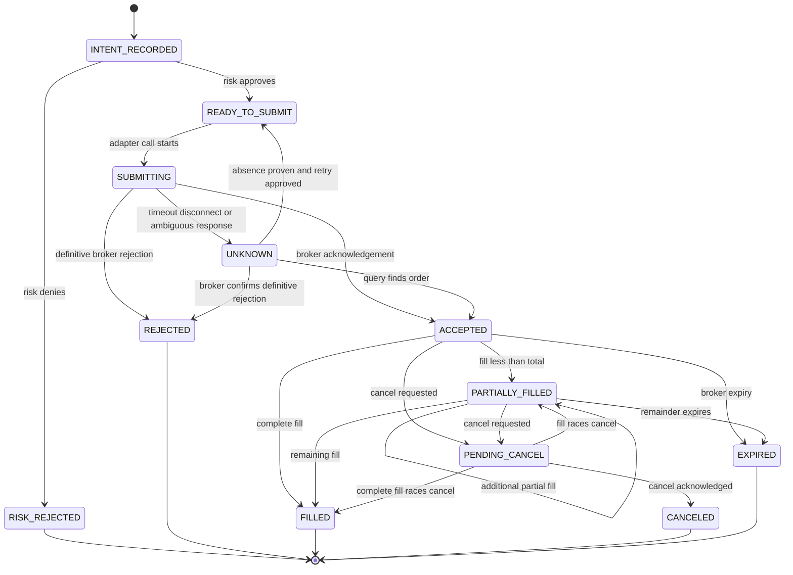

# Broker Execution and Reconciliation Specification

<details open>
<summary><b>Contents</b></summary>

- [Purpose](#purpose)
- [Broker Boundary](#broker-boundary)
- [Environment and Account Guard](#environment-and-account-guard)
- [Canonical Order Model](#canonical-order-model)
- [Order State Machine](#order-state-machine)
- [Idempotency](#idempotency)
- [Submission Protocol](#submission-protocol)
- [Unknown Outcomes](#unknown-outcomes)
- [Partial Fills Rejects and Cancels](#partial-fills-rejects-and-cancels)
- [Rate Limits and Connectivity](#rate-limits-and-connectivity)
- [Reconciliation](#reconciliation)
  - [Reconciliation Triggers](#reconciliation-triggers)
  - [Comparison Domains](#comparison-domains)
  - [Mismatch Handling](#mismatch-handling)
- [Startup and Restart](#startup-and-restart)
- [Session Lifecycle](#session-lifecycle)
- [Adapter Contract Tests](#adapter-contract-tests)
- [Paper Acceptance](#paper-acceptance)
- [Open Decisions](#open-decisions)

</details>

---

**Version:** 1.0  
**Date:** 30 August 2026  
**Status:** Proposed baseline  
**Related:** [Requirements](01-requirements.md) | [Architecture](02-architecture.md) | [Risk Specification](03-risk-and-safety.md)

## Purpose

This specification defines the safe boundary between internal order intent and an external broker, initially Alpaca paper trading. It treats timeout, retry, partial fill, restart, and reconciliation as normal control paths rather than exceptional afterthoughts.

## Broker Boundary

Domain and application code use a broker port with versioned canonical requests and events. The adapter owns vendor authentication, serialization, pagination, status mapping, rate-limit headers, and transport errors.

The port must support:

- Verify environment, account identity, account status, base currency, and trading permissions.
- Get server time and market-clock or calendar facts for cross-checking.
- List account balances and buying-power fields without making strategy decisions from vendor-specific names.
- List positions.
- List open orders and historical orders over a requested overlap window.
- List fills or activities with stable pagination.
- Get an order by broker ID or client order ID.
- Submit an order with a client order ID.
- Cancel one known order and, for watchdog use, enumerate then cancel approved working orders.
- Stream or poll order events with reconnect and deduplication.

The broker SDK may exist only inside the adapter. Vendor objects must be translated before they enter the order manager, risk engine, ledger, audit events, or tests.

## Environment and Account Guard

Before any order-capable method is enabled, startup must verify:

| Guard | Required outcome |
|---|---|
| Operating mode | Exactly `PAPER` for initial broker operation |
| Base URL | Exact allowlisted paper host using TLS |
| Credential source | Paper credential reference from the approved secret provider |
| Account identity | Exact approved paper account ID or fingerprint |
| Account status | Active and not restricted in a way the system cannot model |
| Trading capability | Instrument and order type are permitted |
| Currency | Matches the account and reporting conversion configuration |
| Clock | Broker and host UTC offset within configured tolerance |
| Single writer | Account and strategy session lock acquired |
| Kill and recovery state | No uncleared kill; startup reconciliation not yet bypassed |

Hostnames containing a friendly word such as `paper` are not sufficient verification. Environment identity combines an exact endpoint allowlist, credential namespace, returned account identity, and an order-mode capability guard.

Future `LIVE` mode requires a separate executable entry point or explicit build and configuration capability where practical. It cannot be enabled by changing only a URL or one Boolean value.

## Canonical Order Model

| Field | Rule |
|---|---|
| `logical_order_id` | Internal immutable UUID or equivalent identity |
| `client_order_id` | Deterministic broker-visible idempotency key within provider limits |
| `parent_intent_id` | Durable strategy or recovery intent identity |
| `session_id` | Trading session identity |
| `strategy_id` and `strategy_version` | Approved source of the intent |
| `instrument_id` and `symbol` | Approved registry identity and current broker symbol |
| `side` | `BUY` or `SELL`; no implicit sign convention |
| `quantity` | Positive decimal quantity with instrument precision |
| `order_type` | Explicit allowed canonical type |
| `limit_price` and `stop_price` | Decimal and present only when required |
| `time_in_force` | Explicit canonical value |
| `eligible_at_utc` | Earliest permitted submission time |
| `expire_at_utc` | Explicit final eligibility where applicable |
| `decision_as_of_utc` | Information cutoff used by the strategy |
| `risk_decision_id` | Passing pre-trade risk result |
| `created_at_utc` | Internal creation time |
| `purpose` | `STRATEGY`, `RISK_REDUCTION`, `RECOVERY`, or approved extension |
| `status` | Canonical lifecycle state |

Quantities and prices use decimal representations at the broker boundary. Side is never inferred from a negative quantity. Order mutation is represented as a new command or replacement relationship, not in-place historical rewriting.

## Order State Machine



Broker-specific statuses map into this canonical state machine through an explicit tested table. An unrecognized broker status maps to `UNKNOWN` and halts affected execution; it never maps optimistically to canceled or rejected.

## Idempotency

One logical order has one stable `client_order_id` across retries and restarts. It may be derived from a versioned hash of:

```text
account namespace
strategy ID and version
exchange session date
decision identity
instrument ID
side
logical sequence
```

The retry number, process ID, and current timestamp are excluded because they would turn a retry into a new order. The full derivation inputs and collision policy are durable.

Before submission, the order manager checks local intent uniqueness. After any ambiguous outcome, it queries the broker by the same client order ID and searches an overlapping order and fill window before considering a controlled retry. A provider conflict for an existing client order ID is treated as evidence to retrieve and reconcile that order.

## Submission Protocol

1. Accept a canonical intent from the strategy or an approved recovery command.
2. Confirm mode, session, strategy approval, and account ownership.
3. Derive and validate the stable client order ID.
4. Build a coherent broker, market, ledger, pending-order, and risk snapshot.
5. Evaluate all risk checks and persist the decision.
6. Persist the intent and `READY_TO_SUBMIT` transition in a committed transaction.
7. Recheck kill, reconciliation, mode, and order-rate controls.
8. Mark `SUBMITTING` durably with an attempt identity.
9. Call the adapter once using the stable client order ID.
10. Persist the normalized acknowledgement or definitive rejection.
11. On ambiguity, persist `UNKNOWN`; do not infer failure.
12. Consume broker events idempotently and update order, fills, ledger, and risk state transactionally.
13. Reconcile after material state transitions and report any mismatch.

If the intent journal or risk decision cannot commit, no broker call occurs. If the broker call occurs but local acknowledgement cannot commit, recovery queries the external account and adopts the broker fact.

## Unknown Outcomes

Timeouts, connection resets, malformed responses, process termination during submission, and some server errors create an **unknown outcome**. They are not safe retry signals.

Resolution procedure:

1. Stop new dependent orders for the strategy and instrument.
2. Persist or recover the original client order ID and attempt window.
3. Query by client order ID.
4. Query recent open and closed orders with a time overlap and pagination.
5. Query fills or account activities for the same overlap.
6. If exactly one matching order exists, adopt it and process its facts.
7. If conflicting candidates or unexplained fills exist, halt and alert.
8. Only when broker evidence proves absence and the original intent remains eligible may policy authorize one controlled retry with the same client order ID.

An HTTP status alone is interpreted according to the provider contract. Generic retry middleware is prohibited on order-creating calls.

## Partial Fills Rejects and Cancels

- Each fill has a broker fill ID and is consumed exactly once.
- Filled quantity and cost affect cash, position, exposure, and remaining intent immediately.
- Remaining quantity is the broker-acknowledged order quantity minus deduplicated fills, not a local assumption.
- A strategy cannot issue a replacement while the original order or cancel outcome is unknown.
- Definitive rejects record normalized and redacted broker reason, risk context, and whether operator action is required.
- Automatic resubmission after reject is disabled unless a named, bounded policy covers that specific reason.
- Cancel requests are idempotent and target a verified broker order ID.
- A cancel acknowledgement does not erase fills that raced it.
- Replace is modeled as provider-supported atomic replace or as cancel-confirm-then-new-intent; the fallback never overlaps orders unknowingly.
- Day orders that expire are reconciled after session close; stale GTC behavior is out of initial scope unless explicitly approved.

Oversell prevention projects positions using filled quantity plus worst-case remaining sell orders. A risk-reducing sell may not exceed reconciled available long quantity in Stage 1.

## Rate Limits and Connectivity

- Read and write budgets are separate configuration values based on current provider terms.
- The adapter captures provider rate-limit headers without exposing secrets.
- Retry-safe reads use bounded exponential backoff with jitter and a total deadline.
- Order creation never uses generic automatic retry.
- Streaming reconnect resumes with an overlap query so events lost during disconnect are recovered.
- Duplicate stream and query events are deduplicated by stable broker event or fill identity.
- Sustained disconnect blocks new submissions and moves the system to `RECOVERY`.
- Reconnect does not resume strategy operation until orders, fills, positions, and cash reconcile.
- Rate-limit exhaustion that prevents risk or state freshness halts trading.

Provider limits and behavior must be verified from current official documentation during implementation; numeric values are configuration, not hard-coded assumptions in this specification.

## Reconciliation

### Reconciliation Triggers

Reconciliation is mandatory:

- On every startup before strategy evaluation.
- After reconnect or stream gap.
- After any `UNKNOWN` submission or cancel outcome.
- After a partial fill sequence or unexpected reject.
- Before and after an approved recovery action.
- At session close.
- On an operator command.

### Comparison Domains

| Domain | Internal source | Broker source | Required comparison |
|---|---|---|---|
| Account | Approved account registry | Account endpoint | ID, environment, status, currency |
| Positions | Fill-derived ledger | Position endpoint | Instrument, signed quantity, cost metadata |
| Cash and equity | Cash journal and marks | Account balances | Currency amounts under explicit tolerances |
| Orders | Intent and order journal | Open plus overlapping historical orders | Client ID, broker ID, side, quantity, fill, status, terms |
| Fills | Fill journal | Activities or fills endpoint | Stable ID, order IDs, quantity, price, fee, time |

Queries must handle pagination and use a time overlap so boundary events are not missed. Reconciliation stores the raw broker evidence reference, normalized views, tolerances, differences, and result.

### Mismatch Handling

Any unexplained mismatch:

1. Blocks new strategy orders.
2. Moves execution to `RECOVERY` or `HARD_HALTED` based on severity.
3. Preserves internal and broker views without overwriting either.
4. Alerts with a stable mismatch code and redacted summary.
5. Requires a documented resolution action.
6. Requires a regression test when caused by software or an undocumented provider behavior.

The broker fact is the operational authority, but internal history is not rewritten silently. A correction is a new auditable event linking the discrepancy and resolution.

## Startup and Restart

The startup sequence is:

1. Start with order capability disabled.
2. Validate configuration, schema versions, operating mode, and approvals.
3. Acquire the account and strategy single-writer lock.
4. Verify paper endpoint and account identity.
5. Check operator kill and independent watchdog health.
6. Replay committed intents, orders, fills, and ledger checkpoints.
7. Query broker account, orders, fills, and positions over a safe overlap.
8. Resolve `SUBMITTING`, `UNKNOWN`, and pending-cancel states.
9. Recompute cash, positions, daily PnL, drawdown, and order-rate counters.
10. Run and persist full reconciliation.
11. Adopt or cancel surviving working orders according to policy.
12. Load strategy state only after reconciliation passes.
13. Verify current data and session eligibility.
14. Enter `READY`, then `RUNNING` for an authorized decision cycle.

Restart never clears a kill, daily-loss halt, drawdown halt, unknown order, or reconciliation break.

## Session Lifecycle

| Phase | Required actions | Exit condition |
|---|---|---|
| Preflight | Lock, mode and account guard, clock, kill, watchdog, recovery, reconciliation | All pass |
| Data readiness | Calendar, prior bar completeness, freshness, actions, instrument mapping | Published current view available |
| Decision | Load approved strategy and exact as-of view; produce zero or more intents | Decision audit event committed |
| Execution | Risk, journal, submit, consume updates, and reconcile | All intents terminal or explicitly managed |
| Close | Final state query, reconciliation, daily report, heartbeat state | Report delivered or alert raised |
| Shutdown | Disable order capability, release lock, retain halt state | Clean process exit |

A no-trade session still completes each applicable phase and records why no order occurred. Silence is not a healthy-session signal.

## Adapter Contract Tests

Every adapter implementation must pass the same reusable suite against a deterministic fake and, where safe, the provider paper sandbox:

- Environment and account mismatch rejection.
- Decimal, symbol, side, order type, and time-in-force mapping.
- Submit acknowledgement and definitive rejection.
- Timeout before and after simulated broker acceptance.
- Duplicate client order ID behavior.
- Partial fill, multiple fills, full fill, and duplicate fill event.
- Cancel acknowledgement, cancel rejection, and cancel-fill race.
- Unknown broker status.
- Pagination with boundary overlap.
- Stream disconnect, reconnect, gap recovery, and event deduplication.
- Rate-limit responses and bounded read retry.
- Position, cash, order, and fill normalization.
- Redaction of request, response, and exception content.

Tests must not use production credentials or endpoints.

## Paper Acceptance

The paper adapter is accepted for Stage 1 only when:

- It cannot address a live endpoint under the paper build and configuration.
- Account and environment guards fail closed.
- One approved paper order appears once in broker UI and local state.
- Deliberate reject, partial-fill simulation, disconnect, timeout, and restart paths are exercised.
- Client order ID retry tests produce one logical broker order.
- Startup with an existing paper position and working order reaches the documented reconciled state without duplication.
- A reconciliation report compares account, positions, cash, orders, and fills.
- Killing the process during an order lifecycle activates watchdog behavior and recovery.
- Logs and reports contain no credential or authorization material.

Stage 4 unattended paper promotion adds the duration, uptime, slippage, tracking, and zero-unexplained-break gates in the rollout plan.

## Open Decisions

| Decision | Needed by | Blocking effect |
|---|---|---|
| Confirm Alpaca access and terms for the owner and selected instrument | Adapter implementation | Blocks source acceptance |
| Select initial order type and order window | Vertical-slice design | Blocks fill and adapter policy |
| Decide fractional versus whole-share quantity | Instrument registry | Blocks decimal and reconciliation tolerances |
| Set polling cadence and stream use | Paper operations | Blocks connectivity policy finalization |
| Define stale working-order adoption versus cancel policy | Restart implementation | Blocks restart acceptance |
| Choose watchdog credential and cancellation capability | Unattended paper operation | Blocks dead-man acceptance |
| Define cash and decimal reconciliation tolerances | Ledger implementation | Blocks reconciliation acceptance |