# Trading Bot Delivery Roadmap

<b>Contents</b>

- [Purpose](#purpose)
- [Planning Assumptions](#planning-assumptions)
- [Dependency Map](#dependency-map)
- [Stage Summary](#stage-summary)
- [Implementation Sequence](#implementation-sequence)
  - [Work Package One Project Foundation](#work-package-one-project-foundation)
  - [Work Package Two Risk and Control](#work-package-two-risk-and-control)
  - [Work Package Three Data Vertical](#work-package-three-data-vertical)
  - [Work Package Four Backtest Vertical](#work-package-four-backtest-vertical)
  - [Work Package Five Paper Execution Vertical](#work-package-five-paper-execution-vertical)
  - [Work Package Six Recovery and Reporting](#work-package-six-recovery-and-reporting)
- [First Thirty Days](#first-thirty-days)
- [Definition of Ready](#definition-of-ready)
- [Definition of Done](#definition-of-done)
- [Work Item Structure](#work-item-structure)
- [Release Milestones](#release-milestones)
- [Change and Decision Process](#change-and-decision-process)
- [Documentation Maintenance](#documentation-maintenance)
- [Stop Conditions](#stop-conditions)

---

**Version:** 1.0  
**Date:** 30 August 2026  
**Status:** Proposed baseline  
**Related:** [Project Charter](../CHARTER.md) | [Requirements](01-requirements.md) | [Rollout Plan](10-paper-and-live-rollout.md) | [Master Task Tracker](../MASTER-TASK-TRACKER.md) | [Parallel Work Protocol](15-parallel-work-protocol.md)

## Purpose

This roadmap turns the reviewed plan and specifications into a build order for one owner working part time. It preserves the six-stage evidence model while making Stage 1 a narrow complete vertical slice instead of a sequence of disconnected frameworks.

## Planning Assumptions

- Capacity is 8 to 10 focused hours per week, pending owner approval.
- Stage 0 takes 1 to 2 weeks of decisions and account or provider checks.
- The first complete vertical slice targets 4 to 6 weeks after Stage 0, subject to broker and data access.
- Daily US-listed ETF bars, long-only paper trading, and one process remain fixed through Stage 1.
- The moving-average strategy tests machinery only.
- Safety, idempotency, restart, and reconciliation are release-critical from the first broker call.
- Documentation is sufficient to define contracts but does not delay executable feedback once owner decisions are approved.
- Estimates are ranges, not deadlines. Gate evidence determines progress.

## Dependency Map

```mermaid
flowchart LR
    Charter[Stage 0 Charter] --> Foundation[Foundation and Schemas]
    Foundation --> Risk[Risk and Kill Controls]
    Foundation --> Data[Data Snapshot and Calendar]
    Risk --> Backtest[Event Loop Backtester]
    Data --> Backtest
    Risk --> Execution[Paper Broker Order Manager]
    Data --> Execution
    Backtest --> Strategy[Machinery Strategy]
    Strategy --> Execution
    Execution --> Recovery[Journal Reconciliation Restart]
    Recovery --> Reporting[Logs Alerts Daily Report]
    Reporting --> Stage1[Stage 1 Gate]
    Stage1 --> Honest[Honest Backtest and Experiment Tracking]
    Honest --> Research[Registered Strategy Research]
    Research --> Paper[Unattended Paper Observation]
    Paper --> Future[Separately Approved Stage 5 Review]
```

Risk and data can progress in parallel after foundation contracts exist. Broker submission waits for risk, durable intent, environment guard, and recovery design.

## Stage Summary

| Stage | Indicative duration | Executable outcome | Gate owner |
|---|---|---|---|
| 0 Decision and constraints | 1 to 2 weeks | Approved charter and broker or data feasibility | Owner |
| 1 Vertical slice | 4 to 6 weeks | One data-to-backtest-to-paper-to-reconciliation loop | Owner with automated evidence |
| 2 Honest backtesting | 6 to 10 weeks | Costs, walk-forward, controls, deterministic experiments | Owner |
| 3 Strategy research | 8 to 16 weeks | Promoted candidate or documented no-edge result | Owner under fixed thresholds |
| 4 Paper trading | At least 3 qualifying months | Unattended tracked operation with zero unexplained breaks | Owner |
| 5 Tiny live | At least 6 qualifying months after separate approval | Small real-fill evidence within limits | Owner plus required professional confirmations |
| 6 Conditional deepening | Only after measured entry conditions | One justified adjacent capability | Owner per decision record |

Durations do not include waiting for external account review, professional advice, or data licensing.

## Implementation Sequence

### Work Package One Project Foundation

**Goal:** one repeatable local development and release skeleton.

Deliver:

- Python 3.12 or newer environment and locked dependencies.
- Package boundaries from the architecture document.
- Typed versioned configuration with mode, units, and unknown-key rejection.
- Stable domain values and reason-code registry.
- UTC clock and exchange-calendar port with deterministic test clock.
- Structured event schema, correlation IDs, and redaction boundary.
- SQLite migration approach and atomic local file utilities.
- Offline CI gates for format, type, tests, schemas, links, secrets, and dependencies.

Exit check: a no-op `BACKTEST` and no-order `PAPER` preflight can load a synthetic config, emit a redacted event, and fail safely on each invalid mode or endpoint fixture.

### Work Package Two Risk and Control

**Goal:** all hard denials exist before broker order code.

Deliver:

- Immutable coherent risk snapshot.
- Required limit models with explicit units and no capital-dependent defaults.
- Projected positions and exposure including pending orders.
- Daily-loss and drawdown state with durable sticky halts.
- Internal halt and operator kill control.
- Atomic heartbeat and independent watchdog contract.
- Unit and property-based tests for every boundary and missing input.

Exit check: generated Stage 1 intents can never short, exceed leverage one, bypass a limit, submit under stale state, or continue after a kill.

### Work Package Three Data Vertical

**Goal:** one trusted immutable ten-year ETF dataset.

Deliver:

- Instrument registry and source qualification for one ETF.
- Raw capture, normalization, daily bar, action, calendar, and manifest schemas.
- All twelve `DV-*` checks with positive and negative fixtures.
- Canonical sort, serialization, SHA-256 content identity, and immutable publication.
- Provider revision comparison.
- Time-aware strategy view honoring `available_at_utc`.

Exit check: repeated unchanged pull resolves to identical content; a changed cell creates a new snapshot and revision event; future information is hidden.

### Work Package Four Backtest Vertical

**Goal:** one deterministic complete simulation using the same domain rules.

Deliver:

- Event clock and next-session execution chronology.
- Simulated broker, order states, fills, cash, positions, actions, and marks.
- Required explicit cost configuration and cost ledger.
- Strategy port and machinery-only moving-average implementation.
- Canonical result schema and basic report.
- Mandatory sanity tests for determinism, chronology, benchmark, random, future, costs, actions, partial fills, and no trade.

Exit check: same inputs produce byte-identical evidence, tomorrow-data access is denied, and gross minus net PnL equals modeled costs.

### Work Package Five Paper Execution Vertical

**Goal:** submit one logical order once to a verified paper account.

Deliver:

- Broker port and Alpaca paper adapter behind exact environment and account guards.
- Durable intent journal and deterministic client order IDs.
- Canonical order-state mapping.
- Safe submit protocol and unknown-outcome resolution.
- Partial fill, reject, cancel, rate-limit, and reconnect handling.
- Fake and paper adapter contract suites.

Exit check: retry and restart scenarios yield one logical broker order, wrong-environment cases submit nothing, and no SDK object or secret enters the domain log.

### Work Package Six Recovery and Reporting

**Goal:** prove the system can die and return safely.

Deliver:

- Startup replay and full broker reconciliation.
- Working-order adoption or cancel policy.
- Risk-counter and strategy-state reconstruction.
- Session orchestrator and single-writer lock.
- Primary and secondary alerts, daily report, report verifier, and watchdog behavior.
- Backup, isolated restore, release manifest, and rollback process.
- Crash injection at every journal and side-effect boundary.

Exit check: kill the process with an open paper position and working order; watchdog executes approved behavior; restart reaches a correct reconciled state with no duplicate.

## First Thirty Days

This schedule assumes Stage 0 decisions are available and favors working evidence over calendar perfection.

| Day | Focus | Evidence |
|---|---|---|
| 1 to 2 | Approve charter, initialize repository, establish local environment and CI skeleton | Signed Stage 0 rows and green no-op checks |
| 3 to 4 | Confirm paper account and secret-provider path; implement mode and endpoint guard first | Read-only paper account identity evidence; wrong-mode denial |
| 5 to 7 | Implement risk values, projected exposure, hard limits, and property tests | One passing and failing boundary case per limit |
| 8 to 9 | Implement durable halt, operator kill, heartbeat, and watchdog fake | Kill and expiry exercise reports |
| 10 to 14 | Build one ten-year ETF snapshot, manifest, calendar, actions, and twelve checks | Published data hash and negative fixtures |
| 15 to 19 | Build event-loop backtester, ledger, next-session fills, and costs | Deterministic canonical backtest result |
| 20 to 21 | Add machinery moving-average strategy | End-to-end no-claim strategy report |
| 22 to 23 | Add mandatory backtester sanity scenarios | Passing chronology, random, benchmark, and cost controls |
| 24 to 27 | Add paper adapter, intent journal, client IDs, state mapping, and safe submit | Exactly one visible paper order plus contract evidence |
| 28 to 29 | Add startup reconciliation, daily report, and alerts | Passing clean and mismatch reconciliation reports |
| 30 | Inject process death during an active paper scenario and recover | Stage 1 gate exercise or precise remaining defects |

If a safety-critical item is incomplete, Day 30 remains a rehearsal rather than a gate pass.

## Definition of Ready

A work item is ready when:

- Its requirement or defect ID and owning component are known.
- Desired observable behavior and failure behavior are stated.
- Inputs, units, time semantics, and source of truth are identified.
- Security, risk, data, and migration effects are assessed.
- Acceptance tests or an operational exercise are named.
- External decisions and credentials are available or a deterministic fake is defined.
- No unresolved architecture boundary makes the item speculative.

Research candidates additionally require an immutable pre-registration before confirmatory execution.

## Definition of Done

A work item is done when:

- Implementation follows the owning contract and dependency direction.
- Normal, boundary, invalid, missing, stale, retry, and restart cases applicable to the change pass.
- No new secret, type, lint, schema, dependency, or security finding remains.
- Requirement traceability and relevant documentation are updated.
- Structured events and stable reason codes cover observable decisions.
- Data, config, and state migrations are deterministic and reversible where required.
- Focused tests and the affected broader release gates pass.
- Evidence is linked to the work item and reviewed.

An artefact that exists but cannot be executed, replayed, or measured is not done.

## Work Item Structure

Use stable prefixes:

| Prefix | Use |
|---|---|
| `EPIC-*` | Stage or major capability |
| `REQ-*` | Cross-document product requirement when a category ID is insufficient |
| `DATA-*`, `BT-*`, `RES-*` | Requirement implementation |
| `RISK-*`, `EXEC-*`, `STATE-*`, `AUD-*`, `NFR-*` | Requirement implementation |
| `ADR-*` | Architecture or irreversible decision |
| `EXP-*` | Research registration and run family |
| `INC-*` | Operational, evidence, or security incident |
| `GATE-*` | Stage review bundle |

Each work item includes scope, exclusions, dependencies, acceptance evidence, safety impact, documentation impact, and links to decisions and tests.

Parallel workers must use the claim, task-record, and handoff process in the
[Parallel Work Protocol](15-parallel-work-protocol.md). Only the coordinator
updates master status and summary counts.

## Release Milestones

| Milestone | Scope | Mandatory proof |
|---|---|---|
| `M0-foundation` | Offline skeleton and fail-closed mode guard | CI and invalid-config evidence |
| `M1-risk` | Risk engine and kill controls | Boundary, property, sticky-state, and watchdog tests |
| `M2-data` | One immutable reference dataset | Twelve checks, hash, revision, and availability tests |
| `M3-backtest` | Deterministic machinery strategy | Full sanity suite and canonical report |
| `M4-paper-order` | Verified paper adapter and one order | Environment, idempotency, state, and redaction evidence |
| `M5-recovery` | Reconciliation, restart, operations | Crash, mismatch, report, backup, and restore evidence |
| `M6-stage-1` | Complete vertical slice | Signed Stage 1 gate bundle |
| `M7-honest-engine` | Stage 2 controls | Signed engine-validity bundle |
| `M8-candidate` | Stage 3 promoted candidate | Immutable research gate bundle |
| `M9-paper-observation` | Stage 4 qualifying period | Three-month paper evidence bundle |

No current milestone enables Stage 5.

## Change and Decision Process

1. Identify the requirement, assumption, or incident driving the change.
2. Decide whether it changes architecture, market, broker, data rights, strategy, risk, stage threshold, or owner exposure.
3. Create a decision record for consequential or hard-to-reverse choices.
4. Update contracts and test expectations before or with implementation.
5. Run the smallest discriminating check, then affected release gates.
6. Identify and invalidate prior evidence if behavior or assumptions changed materially.
7. Require owner sign-off for charter and gate-controlled changes.

Safety limits can be tightened immediately with recorded evidence. Relaxation is never an emergency shortcut.

## Documentation Maintenance

- The root index links every authoritative document and template.
- Every Markdown file keeps its section navigation synchronized.
- Requirements use stable IDs and map to owner documents and planned tests.
- A document names status, version, date, authority, and related contracts.
- Behavioral changes update docs and executable tests in the same work item.
- External figures and terms include an as-of date and review trigger.
- Superseded documents remain linked from a decision or history record; conflicting active versions are prohibited.
- Monthly review resolves stale `TBD` fields or confirms why they remain blocking.

## Stop Conditions

Pause implementation immediately when:

- A broker or data term appears to prohibit the intended use.
- A required owner decision would be guessed rather than approved.
- A safety-critical test cannot be made deterministic or an unknown order cannot be reconciled.
- The architecture would allow strategy code to bypass risk or durable intent.
- Current evidence depends on invalid or materially revised data.
- A secret may have been exposed.
- Work drifts into an out-of-scope technology without a measured entry condition.

Apply the charter abandon criteria when their thresholds are reached. A deliberate stop is a valid delivery outcome.
